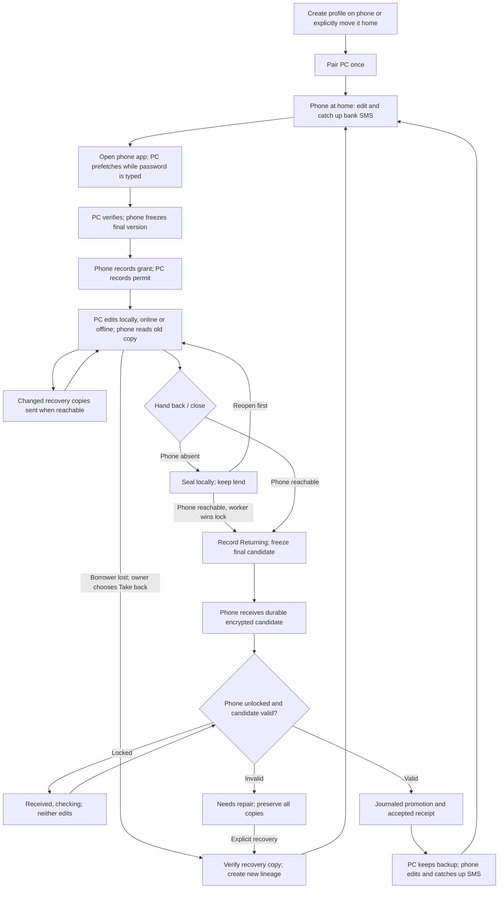

# Multiple devices: implementation plan

**Status: planned, not built · 2026-10-04 · Codex, integrating Claude's review and the owner's decisions.**

One Android phone holds the accepted encrypted ledger. It can lend editing to one paired Windows PC or laptop, which works from its own local copy even when the phone leaves. Returning the copy brings editing home. There is no automatic merge and no cloud dependency.

This replaces the earlier proposal and separate review with one plan. The owner's product decisions live in [Project Overview](../PROJECT_OVERVIEW.md#product-decisions-that-must-hold); this file owns the proposed implementation, sequencing and acceptance gates. [NOW.md](../../NOW.md) owns claims and the next task. Existing financial and encryption contracts remain in [Architecture](../ARCHITECTURE.md). Nothing here means sync or Android support already exists.

**Start here for implementation:** read NOW.md, the row for your task in section 15, and that row's **Read** sections. Read section 5 once when joining the project. Task numbers identify work packages, not a requirement to wait for every lower number. Section 15 names dependencies, independent work and the smaller commits within large packages; do not load the whole plan for every task.

## Contents

| Section | Use it for |
|---|---|
| 1. Requirements and version 1 boundary | Owner requirements, deliverables and exclusions |
| 2. User journeys and names | Everyday use and visible states |
| 3. Existing foundation and implementation boundaries | Reuse, new modules and prerequisites |
| 4. Storage, identities and durable records | Files, authority and wire contracts |
| 5. Safety invariants and state machines | Who may write and why |
| 6. Pairing and local transport | Trust, discovery and transfer |
| 7. Prefetch and lend | Getting a consistent copy and editing permit |
| 8. Editing, recovery copies and closing | Offline use and bounded background work |
| 9. Hand-back and crash-safe promotion | Verification, publication and receipts |
| 10. Take-back, restore and lost devices | Explicit recovery without merging |
| 11. Android shell and lifecycle | Runtime feasibility, storage and background limits |
| 12. Bank SMS and statement matching | Catch-up, parsing and duplicate prevention |
| 13. Compatibility and updates | Schema ownership and release coordination |
| 14. Performance and resource budgets | Measurements and provisional targets |
| 15. Implementation work packages | Dependency order and completion gates |
| 16. Verification and release acceptance | Fault matrix, CI and ordinary-device checks |
| 17. Decisions, risks and next action | Settled tradeoffs and remaining evidence |
| 18. References | Code anchors and primary platform sources |

## 1. Requirements and version 1 boundary

The nine requirements from the owner's review are retained below as acceptance obligations, rather than a second competing design.

| ID | Requirement | How this plan satisfies it |
|---|---|---|
| R1 | The mobile phone is home and lends to different PCs, one at a time. | One authoritative home identity per profile; serialized grants; local Wi-Fi and hotspot first. |
| R2 | Connect briefly, then the PC works alone. | A durable permit and local SQLCipher working copy; no heartbeat or online lease required for edits. |
| R3 | The phone also writes, including planned bank SMS entry. | Home-only writable mode; SMS uses the same services as ordinary entries. |
| R4 | Handoffs should take seconds. | Prefetch, a verified quiesced-file fast path, and explicit real-device latency gates. This is a target, not an existing measurement. |
| R5 | Use the simplest practical approach with the lowest downside. | Reuse services, snapshot verification and profile lifecycle; whole encrypted files; no database merge or remote finance server. |
| R6 | Fetch while the PC password is typed. | Trusted devices can transfer ciphertext before data-key unlock; the copy is never a writing permit. |
| R7 | Save before closing and send recovery copies about every three minutes. | Normal local commits, periodic changed-copy snapshots, sealed offline close, and delivery status. A failed upload is never reported as protected on the phone. |
| R8 | Read SMS only when the phone holds the ledger; catch up after return. | No SMS observer, receiver or capture queue during a lend; query the inbox after verified home acceptance and unlock. |
| R9 | Everything stays local. | No cloud, relay, analytics upload or automatic OS backup of this profile. Local encrypted backup and recovery only. |

Owner refinements incorporated: open the phone app once to become reachable; keep a notification-backed service only while useful and permitted; close away from the phone into a resumable sealed copy; keep prefetch and returned copies as backups; learn bank formats over time; only the home migrates the database.

**Version 1 delivers:** one Android home per profile, Windows borrowers, phone reads during a lend, pairing/revocation, prefetch, Lend, recovery copies, Hand back, explicit Take back, local backup/restore, compatibility checks, and optional bank SMS ingestion after its own platform and deduplication gates. Linux may run the protocol test harness; supporting a Linux borrower release is separate acceptance work.

**Deferred:** general reader devices, a server home, remote internet access, cloud storage, simultaneous writers, automatic merges, incremental database replication, a separate version-store service, iOS, live files on shares, and automatic data-key rotation. USB is a later transport option until tested; do not promise that plugging in a cable works. Two PCs are a development harness, not a silent change to the phone-home product scope.

## 2. User journeys and names

Use the established names below in code and tests. Screens use plain actions and the owner's device name; hashes and epochs appear only in diagnostics.

| Term | Meaning | User wording |
|---|---|---|
| Home node | Phone authorized to accept hand-backs for this profile | Your phone |
| Paired device | Trusted PC with its own device identity and password slot | Office PC |
| Writer node | Device currently permitted to change the ledger | Editing here |
| Borrower | Paired PC while it holds the writing permit | Editing on this PC |
| Reader node | Phone displaying the last accepted copy during a lend | Lent to Office PC · read only |
| Accepted version | Verified, durably published checkpoint, identified within a lineage | Saved on your phone |
| Prefetch copy | Consistent encrypted checkpoint downloaded before borrowing | Getting your latest copy |
| Working copy | Borrower's editable local database | Changes saved on this PC |
| Recovery copy | Snapshot received during a lend, not accepted as the ledger | Last recovery copy on your phone |
| Sealed copy | Final local snapshot after closing away from the phone | Saved here · hand-back pending |
| Backup | Retained encrypted copy for explicit restore | Backup |
| Lineage | Authority history; replaced explicitly after recovery | Recovery starts a new history |

**First use:** install on phone and PC; create or explicitly move an existing profile home; save the recovery key; scan the PC's pairing QR and confirm both device identities. Choose the PC's own password. An existing standalone PC profile remains standalone until the move-home workflow completes; never silently copy it into two writable profiles.

**Normal borrow:** open Lightning on the phone to make it reachable; this alone does not request the Lightning profile password. Then open the PC, whose password unlocks its local data-key slot while ciphertext downloads. The phone may grant without its profile password only through the verified-checkpoint path in section 7. Otherwise it asks for unlock and explains why (for example, recovering an interrupted save). The PC opens editable pages only after verification and durable permit storage.

### Unlocks in the everyday cycle

“Phone unlocked” below means the Lightning finance session, not merely the Android lock screen.

| Action | Phone profile unlock | PC profile unlock |
|---|---|---|
| Become reachable, discover, transfer an existing encrypted checkpoint or receive a return | No; OS access to the transport identity may still require device unlock after reboot. | No for ciphertext transfer. |
| Lend an unchanged, previously verified checkpoint with clean storage and intact control state | No, provided all section 7 checks pass. | Yes, to verify the copy and activate editing. |
| Recover storage, create a fresh verified checkpoint, pair a new PC or migrate | Yes. | Yes when provisioning/verifying its local slot. |
| Read financial pages, post SMS or accept a returned ledger | Yes. | Yes to view its local copy. |

Do not add a phone-password prompt to ordinary discovery or ciphertext receipt. Do not promise password-free lending from an arbitrary live file. On orderly home lock/close, prepare and durably index the latest verified checkpoint before dropping the key when possible; if preparation fails, preserve data and require unlock before a future lend.

**Fingerprint unlock is a proposal, pending the owner's choice**, not an approved replacement for passwords. If approved, make it an opt-in Android key slot bound to a strong biometric through BiometricPrompt and Android Keystore; a successful UI callback alone must not unlock an unprotected key. Enrol it only after password unlock, retain password/recovery fallback, and test cancellation, lockout, biometric/key invalidation and disabling the option. Never keep the SQLCipher key in the background to avoid a prompt. [Android biometric cryptographic authentication](https://developer.android.com/identity/sign-in/biometric-auth?hl=en). Implementation is conditional subtask 18d; pending approval does not block the password-based cycle.

**Offline work and close:** save normally without the phone. If the phone is absent at close, keep a sealed copy and the lend. On reopening, continue that same lend unless return has already begun. Never discard unsent edits to fetch a newer-looking phone copy.

**Normal return:** Hand back or close while connected. The PC stops editing before transmission. If the phone is unlocked, verification and acceptance can finish immediately. A locked phone can receive bytes, but shows “Received · open Lightning on your phone to finish checking.” Until acceptance, neither device edits. This incorporates the corrected review: receiving without unlock is supported; accepting unverified data is not.

**PC without the phone — analyse the last saved copy:** if no lend is active, offer “View saved copy” immediately, even when discovery fails. After the PC password, open a retained, verified prefetch or handed-back copy through the reader session. Show its capture date, source device, acceptance status and “Read only · your phone may have newer changes.” A prefetch is labelled as a saved checkpoint, never as proof the phone is still unchanged. Let the user choose another retained copy if more than one exists; do not mix figures across copies.

All analysis reads that immutable snapshot. Position-dependent plans use its recorded checkpoint date by default; label fixed-horizon/today-based estimates so they cannot be mistaken for current available cash. Navigation, period filtering and explicitly requested exports work, but posting, editing plans/settings, fetching prices into the database, migration and startup writes do not. Keep the file hash unchanged after a browsing session. A newer incompatible schema gives an update message, never an in-place migration. No retained usable copy means an honest empty state with “Connect to your phone.”

If this PC is BORROWING or SEALED, continue its newer working copy under the existing rules; if RETURNING, show that work read-only and preserve the pending return. Never hide outstanding edits behind an older handed-back backup. Reconnecting refreshes or lends only through the normal protocol; preview never becomes writable by itself. Build this journey in task 18a, independently of the final phone UI.

**Phone during a lend:** show its last accepted copy with a persistent read-only notice, the borrower and the last recovery delivery time. Time-sensitive figures such as Safe to spend must carry the stale-copy context. Mutating actions are unavailable and direct POSTs are rejected. Exports of the accepted read-only copy remain possible if labelled with their version.

**Repair:** explain the blocked action, which device/copy holds the latest known work, and the available next actions. Keep technical diagnostic codes separate from financial data. Implementation must use the existing brand rules; this planning change introduces no new visual style.

## 3. Existing foundation and implementation boundaries

Verified against GitHub source while preparing this plan:

| Existing code | Reuse | Work still required |
|---|---|---|
| `lightning/database/connection.py` | SQLCipher keying, owning-thread checks, read-only open and transactions | Role-aware session creation; prevent any non-writer from obtaining a writable handle. |
| `lightning/database/snapshot.py` | `snapshot()`, `export_snapshot()`, integrity checks and source/copy inventory comparison | Public verification report, safe fast-copy path, durable directory publication and failure instrumentation. |
| `lightning/database/staging.py` | `stage_database()` creates verified encrypted candidates, including committed WAL data | It does not promote candidates; add promotion and restore separately. |
| `lightning/runtime/session.py` | Profile locks, password slots, key recovery, activation/generation changes | Recover control state before unlock/build; drain requests; activate read-only without migration or startup writes. |
| `lightning/runtime/paths.py` | Standalone profile paths and validation | Explicit borrowed-profile paths outside Documents; phone private-storage adapter. |
| `lightning/security/keys.py` | Existing data key and per-password wrapping | Pairing provision, device identity storage and separate transport credential lifecycle. |
| Current import, transaction and reporting services | Financial rules, review and postings | SMS source records, exact-once posting and conservative cross-source matching. |

The existing `ProfileSession.unlock()` ultimately calls `build(..., backup_on_start=True)`. Reusing this unchanged for a reader would allow migration/startup behavior. Add an explicit session mode before wiring sync; a disabled button is not a write barrier. The current snapshot inventory is private and compares a source to its copy. A changed return cannot be required to equal the original borrowed ledger; verify its own source-to-snapshot inventory, then its contents and structural invariants on the phone.

Proposed ownership, subject to normal implementation review:

| Module/work area | Responsibility |
|---|---|
| `lightning/database/promotion.py` (new) | Candidate publication, file durability adapter and restart recovery; no network. |
| `lightning/sync/domain.py`, `state.py` (new) | Typed manifests, permits, receipts, transitions and local control store. |
| `lightning/sync/service.py` (new) | Serialize Lend/Hand back/Take back; call lifecycle and snapshot APIs. |
| `lightning/sync/transport.py` (new) | Bounded authenticated messages and encrypted file transfer; no finance endpoints. |
| Runtime/session and paths | One local process owner, role gate, generation invalidation, correct data location. |
| `android/` shell (new, after feasibility gate) | WebView, Python host, private storage, foreground service, discovery, permissions and SMS query bridge. |
| `lightning/import_sources/` or a bounded workflow module (new) | SMS identity, parsing, review and matching through existing services. Pick the final package before coding. |
| Shared UI | Device status and actions; no financial calculation or authority decisions in JS. |

All encrypted database access and lifecycle changes stay on the owning runtime thread. Network/Android workers submit bounded commands and return bytes or results; they do not open the active database. Keep sync below the UI and out of financial service dependencies. Build the shared protocol against an in-process fake transport before sockets or Android.

## 4. Storage, identities and durable records

### Files and authority

| Location | Proposed contents | Retention and restrictions |
|---|---|---|
| Phone private, no-backup profile directory | Live `profile.db`, device-local control store, password slot, immutable checkpoint/backup files, receive staging | No network share, external-storage live file or OS restore of authority records. |
| PC `%LOCALAPPDATA%/Lightning/borrowed/<profile_id>/` | Control store, password slot, working file, prefetch, recovery and sealed snapshots | Resolve the actual local app-data path; reject symlinks, hardlinks, unsafe redirection and user-selected sync folders for active borrowed data. |
| Explicit local backup destination | Encrypted database, non-secret profile manifest and verification status | Recovery needs the saved recovery key or an appropriate local slot. Never bundle an unwrapped key. No automatic export to Documents/OneDrive for borrowed profiles. |
| OS credential protection | Device transport key and local control authentication material | Android Keystore / Windows user-scoped protection; separate from the SQLCipher data key. |

Start with the current checkpoint plus two prior accepted checkpoints on the phone, the latest two complete recovery copies for the active lend, and the latest three prefetch/returned backups per PC. These are proposed retention defaults, not permission to delete unresolved work. Protect every file referenced by an active lend, pending return, promotion journal, failed verification or unresolved recovery. Prune only after replacement files and their indexes are durable; on low space, fail the operation visibly rather than delete the last recoverable copy.

The live home database changes during ordinary home use. An accepted-version hash identifies an immutable checkpoint, **not an eternally unchanged live file**. At prefetch, checkpoint the current home contents and assign a version ID; when Lend freezes the final contents, bind the permit to that checkpoint. Keep the base checkpoint throughout the lend for validation and take-back comparison. Local home edits after a completed hand-back do not change the previously issued acceptance receipt.

### Control store and manifests

Use a small **device-local SQLite control store**, separate from the finance database, with serialized transactions and full durability settings. It contains no ledger rows or SMS bodies. It must work while the finance key is locked. Authenticate network assertions with device identities; protect local files with OS permissions and credentials. Corrupt/missing control state blocks writes instead of recreating an “At home” default. Do not copy this store from phone to PC, include it in ordinary ledger restores, or let a financial rollback roll back writing authority.

| Record | Required fields and constraints |
|---|---|
| Profile authority | Profile ID, home device ID, lineage ID, protocol version, control schema, monotonic checkout epoch, current state/revision, accepted checkpoint ID/hash/schema. |
| Pairing | Device ID/public-key fingerprint, owner-chosen name, allowed profile IDs, pairing ID, active/revoked status; no password. |
| Checkout | Random checkout ID chosen before request, requesting device, home/lineage, epoch, base checkpoint ID/hash, permit, prepared/granted/activated/cancelled status. Unique checkout ID, one active checkout per profile. |
| Return | Random return ID, checkout ID/epoch, parent checkpoint, immutable candidate hash/size, received/verified/promoting/accepted status, durable receipt. Same ID with different content is an error. |
| Recovery | Checkout identity, strictly increasing sequence, candidate hash/size, base parent, received time, verified status. Arrival time cannot replace sequence ordering. |
| Promotion | Operation ID, old checkpoint/hash, new candidate/hash, target name, previous-copy name, phase, intended authority transition. |
| Transfer | Transfer ID, object kind, authenticated manifest digest, expected length, received chunk map and completion status. |
| SMS records | Inside the encrypted finance database: inbox-source epoch/cursor, source identities, review status, parser version and posting links. These travel with the ledger. |

The file manifest includes profile/home/lineage IDs, key ID, checkpoint/parent IDs, schema and cipher format, size and SHA-256 ciphertext hash, operation kind, checkout/return or recovery identity, and sender device. The exact serialized manifest is bound to its authenticated transfer. Add an encrypted singleton profile-identity record through a new migration before first pairing; it binds the database to its stable profile ID but does not carry a live permit or replace device-local authority. Inventory reports and financial details stay encrypted; a ciphertext hash is for transfer integrity, not proof of financial correctness. Times support user messages only. Use random IDs and durable counters for correctness.

Proposed protocol messages: `PairBegin/PairConfirm`, `Status`, `Prefetch`, `BorrowRequest`, `BorrowGrant`, `BorrowActivated`, `BorrowCancel`, `TransferBegin/Chunk/Complete`, `ReturnStatus`, `Received`, `Accepted`, `Revoke`. Define bounded schemas and error codes before implementing transport. All mutating requests carry an operation ID; replay returns the stored result. Retain grant/cancel tombstones and acceptance receipts for the current lineage even after backup pruning.

## 5. Safety invariants and state machines

1. At most one device has permission to commit new work to the current accepted lineage. A home transition closes its write gate and drains existing transactions before granting a borrower.
2. Prefetch, discovery, a recovery upload, a heartbeat, closing a window and a timer never transfer writing authority.
3. The home commits the grant before sending it. The borrower commits the permit before writing. Missing acknowledgement cannot release the grant.
4. The borrower commits `RETURNING` before a final candidate can be delivered. That state never resumes edits automatically, even when the phone is unreachable.
5. Only a fully verified, durably published candidate can produce an acceptance receipt. “Received” does not mean “Accepted.”
6. File replacement and authority publication have a recovery journal. Restart resolves it before any financial connection becomes writable.
7. A retry has the same operation ID and content. An ID reused with another hash, device, epoch or parent is rejected.
8. Recovery, forced Take back and replacement-home setup create a new lineage. An old borrower can keep modifying its offline file but can never return it into the new lineage.
9. Ambiguous or damaged authority stops writing and preserves evidence. A timeout never selects a winner.
10. No migration, seed, SMS import, revaluation, setting update or maintenance path bypasses the role gate. Readers use actual read-only SQLCipher connections.

“Exactly one writer” does not mean there is always a writer. Returning, verification and repair may intentionally leave none. After explicit Take back, an unreachable old PC may still write its stale copy; this is fenced from acceptance, not magically prevented offline.

### Home state

| State | Finance access | Allowed transition |
|---|---|---|
| `AT_HOME` | Writable only after unlock and ordinary session checks | Begin prefetch (no authority change), or durable `PREPARING_LEND`. |
| `PREPARING_LEND` | Gate closed; transactions drained | Freeze/verify base, then `LENT`. Before any durable grant, abort back home after restart reconciliation. |
| `LENT` | Last accepted copy read-only | Recovery upload stays here; final upload leads to `RETURN_RECEIVED`; valid pre-activation cancellation returns home; explicit Take back enters recovery. |
| `RETURN_RECEIVED` | Old accepted copy read-only; candidate inaccessible | Unlock and verification lead to `PROMOTING`; validation failure leads to `NEEDS_REPAIR`. |
| `PROMOTING` | No finance session | Finish durable publication into `AT_HOME`, or recover deterministically into blocked state. |
| `NEEDS_REPAIR` | Verified old copy may be read-only | Explicit repair, retry exact return, or Take back; never timeout into writable mode. |

### Borrower state

| State | Finance access | Allowed transition |
|---|---|---|
| `PREFETCHED` | Verify/read only after unlock | Record `BORROW_PREPARED` before requesting the grant. |
| `BORROW_PREPARED` | No edits | Persist matching grant into `BORROWING`, or durable `ABORTED` and authenticated cancel. |
| `BORROWING` | Writable after unlock | Recovery snapshot; offline close to `SEALED`; final hand-back to `RETURNING`. |
| `SEALED` | No open writer | Under the same local process lock, resume `BORROWING` or transfer immutable sealed bytes into `RETURNING`. |
| `RETURNING` | Read-only; candidate immutable | Retry upload/status until `HANDED_BACK`; failure may require repair, never automatic resumption. |
| `HANDED_BACK` / `ABORTED` | Backup/preview only | A fresh lend requires a new checkout ID. |
| `NEEDS_REPAIR` | Preserve working/candidate files | Reconcile with the home or explicit recovery. |

A cancellation is permitted only if the PC durably records that this checkout **never became writable**. If it activated, even with no user edits, it returns through normal Hand back. This removes the unsafe ambiguity between “grant arrived late” and “grant was already used.” If cancellation arrives before the original request, the home stores its tombstone so a reordered request cannot grant it later.

## 6. Pairing and local transport

1. With the phone profile unlocked, the PC creates a transport identity and displays a short-lived, single-use pairing QR containing an endpoint, public-key fingerprint, pairing ID and random challenge. No database key is in the QR.
2. The phone scans it, pins that endpoint's identity and displays the PC name; the PC shows the phone identity for confirmation. Bind both confirmations to the pairing challenge to prevent a second device joining the same approval.
3. Establish authenticated encryption using a maintained TLS implementation. Bootstrap trust from the scanned fingerprint and confirmed challenge; later use mutually authenticated, pinned device identities. Discovery must never approve certificates.
4. Provision the existing data key over that channel only with the phone unlocked and the PC ready to wrap it under its own chosen password. Neither password nor recovery phrase crosses the network. Persist the PC slot and verify it before marking pairing complete.
5. Pairing authorizes access to this profile, not every profile on the phone. Revocation prevents future connections/grants. Revoking an active borrower does **not** bring the ledger home; offer reconnect/return or explicit Take back. A copied data key remains usable for old encrypted copies.

Transport identity must remain available for ciphertext-only prefetch and locked receipt, while the data key remains password protected. Verification reports that contain table metadata travel only over the authenticated channel and are encrypted at rest beside the candidate, never in the plaintext control store. Store the transport key with OS protection available in the normal logged-in device session; after reboot/credential lock it may be unavailable until the OS is unlocked. If this cannot be implemented safely, show “Open Lightning on your phone” rather than weaken data-key protection.

Use Android NSD/mDNS as a discovery hint and a manually entered local endpoint as fallback. Require the pinned identity on either path. Bind only the intended local interface; do not use UPnP, port forwarding, a relay or the UI listener. Keep FastAPI finance pages on loopback with existing origin/cookie/session protections. A local subnet is not a trust boundary.

Transfer whole encrypted snapshots with bounded chunks (initial proposal: 1 MiB), bounded concurrent staging (one per active operation), explicit object size/quota, resumable offsets and final SHA-256 verification. Reject invalid paths, unexpected object kinds, oversized metadata, extra bytes and mismatched manifests. Chunk acknowledgements support resumption; only a flushed complete file and durable receive record warrant “Received.” Never unpack arbitrary archives or execute transferred content.

Use request deadlines and bounded exponential retry (initially 1–30 seconds, with jitter); stopping retries does not end a lend. Classify errors into retryable transport failure, unlock needed, update needed, revoked/stale authority, insufficient space and needs repair. Logs contain operation IDs/stages and sizes/timings, never ledger contents, SMS bodies, passwords or keys.

## 7. Prefetch and lend

### Consistent prefetch

1. First read local control state. A PC already borrowing, sealed or returning resumes that state; it must not replace it with a prefetch.
2. On an otherwise idle paired PC, connect and request the phone's current checkpoint while the user enters the password.
3. On the phone, acquire the profile operation gate, stop new writes and drain active work. For a fast byte copy, close the database cleanly, prove there is no pending journal/WAL state, flush, and copy into a new staging file. If that proof fails, use the consistent snapshot API on the owning thread; never delete sidecars to make copying appear safe.
4. Record the **source hash measured while quiesced** separately from the **snapshot ciphertext hash**. Re-encryption can produce different bytes for identical rows; do not compare a newly exported snapshot hash to the live source as a dirty test.
5. Publish an immutable encrypted checkpoint with its manifest; resume home work once the consistent checkpoint is safe. Send from that file, not the live database. A locked phone can reuse a previously verified checkpoint; creating a new one from dirty or uncertain storage requires unlock and recovery.
6. PC checks transport identity, profile/key/lineage, size/hash and schema compatibility. After password unlock, verify SQLCipher/SQLite and the expected Lightning schema read-only. Keep the copy as an encrypted backup, with verification status. No permit exists yet.

### Locked-phone lending gate

A transport-only lend is allowed only when the phone's local operation gate proves there is no active writer, journal recovery or promotion; its AT_HOME control record is intact; and its latest fully verified checkpoint still represents the current home database. Rehash the clean, closed source and match the stored source hash, verify checkpoint bytes and manifest, and check schema/cipher compatibility, active pairing and the prepared PC request. Do not open the finance database or run validation/migration without its key. The PC must unlock and fully verify the exact checkpoint before requesting its permit.

If any proof is missing or the source changed since verification, answer “Unlock Lightning on your phone to prepare the latest copy,” keep authority at home, and use the ordinary unlocked snapshot path. A hash alone cannot establish database validity. Restarts with uncertain file/control state require repair, not an optimistic grant. Test clean locked lends, changed sources, missing checkpoints, hot journals, pending promotions and OS-credential unavailability.

### Grant sequence

1. PC durably stores `BORROW_PREPARED(checkout_id, base_version, device_id)`, then asks to borrow that exact checkpoint.
2. Home serializes the request against other borrowers and SMS/finance writes, records `PREPARING_LEND`, drains work and compares the quiesced source hash with the prefetch source hash. If changed, produce a replacement checkpoint, send it and require the PC to verify it. Keep home writes paused through this final validation or abort preparation before granting.
3. Check protocol, schema, cipher format, key ID, pairing and the absence of another active checkout again. Freeze the chosen checkpoint as the base, increment the epoch, commit `LENT` and the full permit, then send the grant. Reopening the home uses read-only mode.
4. PC checks the permit against its prepared request, makes its verified working file durable, stores `BORROWING`, invalidates old session generations, then opens writable. Send `BorrowActivated` as useful confirmation; it is not what makes the home lent.
5. On lost replies, repeat `Status`/the same request. The home returns the stored permit. If the PC aborts before activation, persist `ABORTED` before sending cancel; reject every delayed grant for it. Only a durable matching cancellation lets the home resume. Otherwise remain lent until return or explicit recovery.

A preparation timeout can release a gate only when durable state proves no grant was issued. Never expire an issued permit. Two simultaneous borrow requests must yield one grant and one clear “Lent to…” response.

## 8. Editing, recovery copies and closing

Ordinary SQLite transactions remain the first durable save. Recovery copies supplement them; no editor waits for network permission after activation. A profile lock and the persisted permit survive restarts. Missing control state is repair, not a fresh standalone profile.

While unlocked and changed, schedule one consistent snapshot about every 180 seconds, measured with a monotonic timer. Do not overlap snapshots; coalesce changes during an upload into the next one. Compare a safely captured source-file hash to the last sent source hash, not `audit_log` growth and not hashes of separately re-encrypted exports. The audit log is incomplete for settings and other edits. A write counter may optimize scheduling later, but it cannot replace the correctness check until all writers are covered.

Give each recovery snapshot a durable sequence within the checkout. The phone accepts bytes only for its current checkout and stores newer complete sequences without promoting them. Verify fully when the phone is unlocked; retain the last fully verified recovery copy if a newer one is only hash-checked. A late upload cannot overwrite a newer sequence or a final return. The PC displays the last **acknowledged** sequence/time, not the time an upload started.

On PC lock, finish or safely defer the current operation, create a consistent encrypted snapshot while the key is available, then wipe the data key under existing lifecycle rules. A worker may send already sealed ciphertext without retaining the key. Sleep, suspension or an absent phone can prevent the three-minute target: show the delivery gap. No edits occur while the finance session is locked.

At close:

- If home is reachable, quiesce and create the final verified candidate, record `RETURNING`, then upload. Window closure can leave a bounded transfer worker running with visible tray/status indication.
- If unreachable, create and flush a sealed snapshot, store `SEALED` and the queued hand-back intent, then close. If snapshotting fails, preserve the working database, report the failure and do not claim a successful seal.
- The retry worker and reopened app acquire the **same process/profile lock**. If reopening wins while still sealed, it cancels that queued send before enabling edits and invalidates the old sealed candidate. If the worker already recorded returning, reopening stays read-only. This prevents an old sealed copy being returned while new edits are made.
- Do not promise delivery after the PC shuts down or the phone stops listening. Resume on the next app launch or an explicitly supported bounded background run. No perpetual hidden service is required.

Proposed reminder defaults: stop an unused ready session after five minutes; stop listening after roughly 20 minutes without authenticated borrower contact; remind after eight hours and then at most daily. Platform limits may stop it earlier. These timings are tuning proposals from the review, not writing-lease expiry. The app banner remains the source of status if notifications are disabled.

## 9. Hand-back and crash-safe promotion

### Return protocol

1. Borrower obtains the local operation gate, invalidates writable forms, drains transactions, closes the working connection and creates a verified final candidate. Persist its hash, size, inventory report and return ID under `RETURNING` before sending any final bytes. Subsequent retries use the same candidate and IDs.
2. Home authenticates the sender and validates profile/home/lineage, epoch, checkout, parent, cipher/schema and return identity. Previously accepted returns get their stored receipt; a different hash under the same return ID is rejected. Receive into an exclusive staging name.
3. Flush the complete candidate, verify length/hash, durably store `RETURN_RECEIVED`, then reply **Received**. While locked, retain old accepted data and wait. Never open the candidate for ordinary screens or post SMS at this stage.
4. On unlock, open the candidate read-only with the local data key. Check SQLCipher page integrity, SQLite integrity and foreign keys; expected migrations/application schema; profile/key binding; and candidate inventory against the borrower's authenticated verification report. Run bounded structural ledger checks (valid references, transaction/posting invariants). Existing incomplete valuations are not corruption and must remain distinguishable from structural failure.
5. If checks fail, retain the candidate, base and working backups; enter repair. Offer retransfer of the exact bytes for transport failure, or explicit recovery/inspection for an invalid candidate. Never silently restore the old ledger and start spending.
6. If checks pass, promote using the journal below. Only after publication commits may the home open writable, acknowledge **Accepted**, and begin SMS catch-up.
7. Borrower stores the accepted receipt and `HANDED_BACK`, keeps the final encrypted backup and disables the old permit. A lost receipt is resolved by status, not by returning again under a new ID.

Verification can show that the candidate is intact and follows supported structure. It cannot prove that a trusted device's transactions are truthful. Every paired device already has the data key; this is a cooperative single-user protocol, not protection against a malicious financial editor.

### One publication algorithm reused by restore, move-home and return

File rename alone is not a transaction with the control store. Implement one reusable promotion journal with platform-specific durable file operations:

| Durable step | Persisted evidence | Restart rule |
|---|---|---|
| P0: stage | Complete immutable candidate and verification report; existing live file untouched | Unreferenced partials are not eligible for acceptance. |
| P1: prepare | Control transaction records `PROMOTING`, operation identity, old/new hashes and names | No writer can open; locate only the named files. |
| P2: protect previous | Flush a separate verified old checkpoint/backup; record readiness | Never unlink the only old copy. Disk-full leaves old data preserved and state blocked. |
| P3: publish file | Atomically replace live path with candidate on the same filesystem; flush file and containing directory using the platform adapter | Check named live/old/new hashes. If new is present, finish verification/publication; if old remains, retry or abort to blocked repair. Ambiguity stays blocked. |
| P4: publish authority | One control transaction commits accepted checkpoint, consumed return, exact receipt and `AT_HOME` (or target recovery state) | The new authority is committed; retries return the stored receipt. |
| P5: activate | New session generation and writable connection; later prune unreferenced files | Cleanup failure cannot undo acceptance or invalidate its receipt. |

Do not leave a writable session alive between P1 and P4. Before P4, a crash may finish promotion or restore the old path **while still blocking edits**; it may not quietly reopen the old ledger for writes after the borrower has returned. After P4, do not silently roll back accepted history, even if the acknowledgement was lost.

The same directory/filesystem is required for publication. Flush failure is failure, not a warning to ignore. Windows needs a tested durability adapter rather than assuming POSIX directory `fsync` works there. Process-kill tests are necessary but do not alone prove power-loss behavior. Preserve immutable files plus the journal until ordinary-device power-loss/reboot tests pass.

## 10. Take-back, restore and lost devices

### Explicit Take back

Only the unlocked home owner initiates it. Show the last accepted checkpoint, each available recovery copy with sequence and **received/verified** status, the last contact, and the possibility of newer edits on the PC. Do not describe a hash-checked recovery file as fully verified.

1. Fence the old checkout locally by entering a recovery state; block all grant/return/finance operations.
2. Let the owner choose a recovery copy or the accepted base. Fully verify the chosen candidate before it can become home.
3. Create a new lineage and record the retired checkout/old lineage. Use the promotion journal even when the chosen data is the existing accepted file.
4. Open writable only after the new authority and data commit. Old returns remain quarantined; send revocation/new-lineage status when that PC reconnects.
5. Compare a returning stale PC's copy against the retained checkout base and chosen recovery copy, table by table. Show added/changed/deleted records and unmapped changes. A row diff is an inspection aid, not a replayable transaction log; never replay arbitrary SQL or merge balances. Re-entry uses normal services.

State the actual last recovery timestamp. There is no fixed three-minute loss bound when transfers, power or background execution were interrupted.

### Other recovery cases

| Case | Recovery path | Important limit |
|---|---|---|
| Borrower lost/dead | Explicit Take back from a verified recovery copy or accepted base | PC-only edits and its backups may be gone. |
| Phone lost while lent | Preserve PC working/sealed copy; explicitly initialize a replacement home, new identity and lineage; pair again | Old phone cannot be remotely erased or stopped offline. Do not reconnect it as an active home. |
| Phone lost while at home | Select and verify a retained PC prefetch/return backup; restore to a replacement home/new lineage | Phone edits since that backup may be missing. SMS might not exist on the replacement phone. |
| Lost acceptance receipt | Query original return ID and compare stored receipt fields | Do not issue a fresh lend or resume the old one while uncertain. |
| Control store lost/restored from an old backup | Block writes; preserve ledger files; perform explicit recovery with a new lineage and re-pair | A database file alone cannot prove current writing authority. |
| Wrong password or damaged slot | Existing recovery-key workflow, then verify candidate | A missing key is never permission to open plaintext or reinitialize. |
| Revoked borrower returns | Quarantine and inspect; explicit owner recovery only | Revocation does not remove its knowledge of the data key. |
| App uninstall/reinstall | Warn before removal where the app can; restore local backup explicitly | Private phone storage and transport keys may be deleted. |
| No surviving usable copy/key | Report unavailable recovery; preserve evidence | Do not invent history from timestamps, balances or partial SMS. |

### Moving an existing standalone profile home

This is an explicit one-time workflow, separate from ordinary pairing. Finish the single-PC restore foundation first. Select the existing profile, unlock, acquire its process lock, quiesce and create a verified encrypted candidate. Record `MOVING_HOME` on the PC before sending. The phone initializes a new authority/lineage and accepts via the same promotion protocol. Until the PC confirms the phone's durable receipt, it remains blocked; lost replies use the same operation ID. After acceptance, turn the original PC file into a retained read-only backup and enter paired-device mode. Continuing to edit on that PC requires a normal lend.

If the move is abandoned before acceptance, resume the PC only after a durable, authenticated cancellation proves the phone did not accept; otherwise use status/recovery. Preserve the source file and its backup. There is no silent conversion of plaintext legacy data: use the existing explicit staging route with a new encrypted destination and verify it before move-home.

Ledger backups contain identity/lineage provenance for inspection, but never automatically restore a live permit, pairing list or home authority. Restoring an older backup to an existing home is explicit recovery into a new lineage. This rule prevents backups from resurrecting a second home or an old borrower.

## 11. Android shell and lifecycle

### Prove the runtime before building the product shell

The first candidate is a small Kotlin Android shell embedding the shared Python runtime, with Chaquopy evaluated as the packaging route. Start with Python 3.13 to match current CI, then pin versions only after the dependency spike passes. Chaquopy supports Python on Android, but that does not establish availability of Lightning's native dependencies. Confirm SQLCipher/`sqlcipher3`, `cryptography`, Argon2, FastAPI's native dependencies and all pinned runtime packages on arm64, including devices with 16 KB memory pages. Record reproducible build commands, hashes, licences, APK/AAB size and startup results. [Chaquopy packaging and native-wheel guidance](https://chaquo.com/chaquopy/doc/current/android.html?highlight=test), [16 KB support caveats](https://chaquo.com/chaquopy/doc/current/changelog.html).

Run the existing finance pages over loopback inside Android WebView; reuse the financial services and figures registry. Port the runtime owning-thread lifecycle and origin/session guards. Block foreign navigation, file access, unexpected intents and remote debugging in release builds. Expose only narrow native operations such as pairing scan, local discovery and SMS query. The WebView is not a network API for another device.

Fail the spike if the encrypted database driver or critical crypto cannot be built reproducibly, reports disagree with Windows, or page/unlock behavior is unusable on an ordinary mid-range phone. Record a revised shell/packaging decision before continuing. Do not respond by creating a second financial implementation or a phone-hosted thin client for the PC.

### Foreground/background behavior

Open the phone app to start a reachable session. Use a notification-backed service during pairing, preparation, active recovery transfer and hand-back, subject to OS rules. Evaluate `connectedDevice` for actual local-device communication and meet its declared prerequisites; do not choose a service type merely to evade a timeout. If using `dataSync`, handle its background time budget and timeout callback. Android's documented limits make “runs forever until return” an invalid guarantee. [Foreground service types](https://developer.android.com/develop/background-work/services/fgs/service-types), [service timeouts](https://developer.android.com/develop/background-work/services/fgs/timeout?hl=en).

Stop after inactivity, on the owner's stop action, on platform timeout, or when the ledger is home. Durable lend state survives all of these. A stopped listener means recovery and return wait until the phone app is opened again. Schedule approximate reminders through supported OS facilities; reminders do not need an always-running Python process and never unlock or reclaim the ledger. Test denied notifications, Doze, battery saver, forced stop, reboot, app update, Wi-Fi switching and an overnight lend.

The finance key is available only during its unlocked session. When locked, the transport service may receive encrypted candidates and update device-local control metadata but may not inspect ledger rows, ingest SMS or accept a return. Do not keep the data key alive solely for convenience.

### Storage and platform gates

Use app-private **no-backup** storage for the profile, snapshots, slots and authority records. Disable cloud backup explicitly and exclude both cloud and device-transfer paths in the applicable Android backup rules; `allowBackup=false` alone is insufficient for all manufacturer transfer behavior. Test backup/restore and phone-to-phone transfer so neither can duplicate writing authority. [Android backup rules](https://developer.android.com/identity/data/autobackup).

Choose minimum/target SDK and the supported-device matrix during the spike using current platform/distribution requirements. Validate local-network discovery permissions, hotspot client reachability, firewall behavior and manufacturer restrictions on actual devices. No bank SMS or plaintext financial data belongs in notifications, Android logs or crash reports. Shared phone-width screens and native back behavior get their own UI acceptance task.

## 12. Bank SMS and statement matching

SMS is an optional ingestion feature on the home phone. It is not part of the lending transport and must not block manual entry or CSV import when permission is denied.

### Capture boundary and cursor

Ingest only while the phone is both **unlocked and AT_HOME** with a writable session generation. On unlock, after verified return, on an explicit refresh and through bounded polling while the home app is active, query the SMS provider for configured bank senders since the last committed scan position, with an overlap window. While lent/returning/locked, do not query, subscribe to, receive into an app queue, or post SMS. The OS inbox holds messages until catch-up.

Store source identity and processing state inside the encrypted ledger, so they travel with hand-backs. Proposed append-only migration tables:

| Table | Purpose |
|---|---|
| `import_source_messages` | Unique inbox-installation/source epoch + provider message ID; sender, bank event reference where present, normalized payload fingerprint, received/event dates, parser version, review/posting status and linked transaction. Keep only necessary bank-message data. |
| `import_source_cursors` | Source epoch and last durably handled provider position; explicit rescan range after recovery/provider reset. |
| `bank_sms_patterns` | Deterministic, versioned bank parsing rules with activation/review state and sanitized fixtures. |
| `transaction_source_links` or extension of existing source metadata | Link SMS, CSV and manual evidence to one posted transaction without deleting provenance. Inspect the existing schema before selecting the final table. |

Process a bounded batch in one transaction: persist messages as posted/review/ignored, then advance the cursor. If a crash occurs before commit, repeat safely. An unclear message can be stored for review without blocking all later messages. Sender/date alone is not a unique identity. Provider IDs may reset on restore; use a new source epoch and conservative overlap/rescan with duplicate suggestions. A body hash alone must not suppress two legitimate equal-value purchases.

Before lending, stop scanning, drain its current transaction, and freeze the cursor with the ledger. Messages arriving after that are caught up when home again. Deleted messages cannot be recovered by this feature. Device replacement must not assume the old SMS inbox is present.

### Parse, teach and post

Use local deterministic parsers, not AI. Explicitly parse direction, amount, currency, account suffix/reference, event time and transaction reference when available. Test Arabic/English messages and numerals, EGP formatting, dates, purchases, receipts, transfers, refunds/reversals, fees and pending/failed events. Exclude OTPs and unrelated personal SMS; a matching sender alone does not prove a posted financial event.

Start unknown formats in review. The owner can mark fields and approve a proposed pattern; test it against saved sanitized examples and negative examples before activation. One annotated message is not sufficient evidence for broad automatic posting. Keep parser versions and allow disabling a pattern without deleting linked history. Record new bank formats incrementally; lack of samples for one bank does not justify guessing.

Automatically post only when a tested rule identifies a completed event, one explicit account, direction/currency/amount and a safe category or approved default, with no duplicate ambiguity. Otherwise ask for review. Own-account transfers need a linked two-sided transaction; investment/certificate events must use their proper workflow or remain in review. Do not disguise them as ordinary spending. Posting, source-link assignment and status change commit together through `TransactionService`/existing workflows; repeated ingestion cannot post the same source event twice.

### Match later CSVs and manual entries

Build this before enabling automatic SMS posting. A strong shared bank reference plus account/currency and compatible amount/direction can identify the same event; preserve both sources on one transaction. Amount/date/merchant similarity alone is only a suggestion. Two purchases of the same amount on one day, delayed bank posting, fees, partial refunds and duplicate imported rows must remain distinguishable.

The import review offers “Link to existing” or “Post as new” for ambiguous matches. A confirmed link must not move money again or silently change an existing transaction's date/category. Voided transactions and reversals require explicit handling; importing again must not silently resurrect a voided entry. Reconciliation against statements remains available even when SMS parsing is incomplete.

Google Play lists SMS-based money management as a possible permission exception, subject to review and approval. Request only the permission actually needed for inbox catch-up (initial proposal: `READ_SMS`), supply the required disclosure/declaration, and handle denial/revocation. Do not infer approval from another finance app. A permissionless manual/CSV workflow remains usable if SMS distribution is not approved. [Google Play SMS policy](https://support.google.com/googleplay/android-developer/answer/10208820?hl=en).

## 13. Compatibility and updates

### Compatible software before database migration

Compare protocol version, control-store schema, ledger schema/migration set, SQLCipher format, key ID and financial/write capability version at connection and grant time. Matching marketing version strings alone is insufficient. For the first release, require an explicitly tested phone/PC release pair; later compatible pairs may be allowlisted by evidence.

Only the home migrates a multi-device ledger, while unlocked, AT_HOME and holding the operation gate. Take and verify the pre-upgrade encrypted backup first. A borrower never migrates its working copy; a phone never migrates while lent or awaiting return. An Android binary update during a lend must still understand its control state and accept the old-schema return before migrating. Retain a tested return/repair path across the previous supported release pair; otherwise defer that release's rollout. Do not assume the app can prevent Google Play from installing a published update.

On mismatch, give a precise “Update Lightning on this PC” or “Finish handing back before updating” action. Do not delete, rewrite or auto-upgrade a sealed/returning candidate. A downgrade that cannot read current schema refuses it; recovering from a pre-upgrade backup creates a new lineage, not a rollback of authority.

Publish coordinated, reproducible Windows and Android artifacts and a small compatibility matrix in release metadata. Keep existing immutable versioned downloads. Emergency repair builds must accept the outstanding operation IDs and preserve existing data. No sync release can require the user to disable OS protections.

### How the PC gets the compatible version

The owner has already requested **in-app Windows updates, planned for later**, in [Project Overview, Roadmap](../PROJECT_OVERVIEW.md#roadmap), recorded by commit [18d7af4](https://github.com/elfekimuhammed/Lightning/commit/18d7af4da92d666b5cbbd2f8276f96d8aa43c7ed). This resolves the review's open product question about update direction; it does not mean the updater is implemented or required before all early deliverables.

Task 19 is divided into a compatibility contract (19a), a usable manual-update path for the first multi-device beta (19b), update/migration rehearsals (19c), and a later signed-updater integration (19d). A generic “Update this PC” error alone is insufficient.

For the first beta, the phone advertises the minimum compatible PC release and supported schema/protocol in authenticated status. The PC shows installed/required versions, why editing is unavailable and an action to the official versioned download archive. The owner downloads/extracts the ZIP into a new folder, closes the old process and reopens; paths, key slots, checkpoints and authority records remain intact. Keep read-only analysis available when its saved copy is supported. No financial data is sent for an update check.

The later Update button follows the existing roadmap: user-requested checks or opt-in automatic checks, authenticated release metadata and independently verified artifact signatures, staged installation, helper-based binary replacement and retained previous binaries. Installing is blocked while a lend, move-home or return is unresolved. Application rollback never rolls back finance data or control authority; an older binary must refuse incompatible schema. The updater's package/tool choice and signing implementation belong to its own work, not a second design copied here.

### Prevent routine phone updates from stranding a PC

Treat app installation and ledger migration as separate events. A released Android update must continue opening the previous supported ledger and reconciling existing lends; do not rely on the user disabling Google Play auto-update. While lent/returning, all migration remains blocked. Once home, show affected paired PCs and the compatible Windows release before a schema-changing upgrade. Defer that migration until those PCs report readiness, or the owner explicitly chooses to proceed knowing which PC must update before another lend. Keep a tested old-schema mode while deferring; if the release cannot do that, it is not ready for rollout.

Cached PC capability information can explain the upgrade screen but cannot replace live version checks on a new grant. An offline retired PC must not block upgrades forever: the owner may remove it from the readiness set without erasing its retained copies. If the home has already migrated, no unsafe downgrade is offered; update that PC through the normal path. Test a weeks-offline PC, phone auto-update while lent, deferred migration at home, manual ZIP replacement, and updater rollback. These checks belong to 19c. Installed version drift alone is not a reason to forbid compatible pairs that the release matrix explicitly tests.

## 14. Performance and resource budgets

The review reported 5 ms for copy/hash, 8 ms for integrity checks and 50 ms for a re-encrypting snapshot on a 0.8 MB, 319-transaction container sample. Keep these as historical observations only; they do not establish Android, Wi-Fi, full-inventory or durable-promotion performance.

Measure encrypted 1, 10, 50 and 100 MB profiles with representative transactions, settings, assets and SMS-source records. Use an ordinary Windows laptop and a mid-range arm64 phone on normal Wi-Fi and a phone hotspot; record cold/warm runs, hardware, OS, versions, free space and at least 20 repeated handoffs. Report median and p95 separately for discovery, source quiescing, snapshot/hash, upload, verification, durable publication and total elapsed time.

Proposed engineering targets to validate, not release promises:

| Measure | Initial target / rule |
|---|---|
| Prepared lend, unchanged prefetched copy | p95 no more than 2 seconds after PC unlock/verification on the reference devices. |
| Complete unlocked local handoff, 1–10 MB | p95 no more than 5 seconds, excluding human password entry; report misses and their cause. |
| Larger profiles | Publish measured time/progress, peak memory and storage needs; no universal seconds guarantee. |
| Ordinary phone pages | Aim for p95 under 1 second on representative populated screens; measure unlock separately. |
| Recovery cadence | Start changed-copy work about every 180 seconds while runnable/reachable; report actual age of last acknowledged copy. |
| Memory and transfer | Stream files/chunks; no whole-database buffering; one snapshot/transfer per profile at a time. |
| Battery and network | Measure a four-hour active lend, an idle lend and overnight absence against an idle-app baseline. Set the release budget from those results before beta. |
| Disk admission | Estimate candidate, retained old/base, recovery files and operation overhead before starting; require sufficient measured headroom, not an assumption of exactly one extra file. |

Do not optimize away full return verification or durability to meet a target. First remove duplicate snapshot/verification work, cache an immutable prefetch safely and measure the quiesced-file path. If targets fail, record a bounded optimization task or revise the product expectation before release.

## 15. Implementation work packages

**Follow dependencies, not a single queue.** The 24 IDs remain stable work packages; the smaller IDs below are the units to claim, finish and verify. A package completes only when its required subtasks pass. A dependent task waits for its listed inputs, but unrelated work can run alongside it. Each commit still needs its own tests and handoff. Use dummy data for the multi-device cycle through task 24; independently released desktop improvements must pass their own existing acceptance gates.

**Read only what the task needs.** Begin with NOW.md and your row. Read section 5 once when joining; the **Read** column names additional sections (numbers refer to this document). Load linked existing code/contracts only when touching them. For a subtask, read its parent row and the relevant subsection, not every section in its range. The 18-section document remains a reference architecture, not a compulsory per-task briefing.

### Work tracks and early deliverables

| Track | Order | Can run beside it | First useful result |
|---|---|---|---|
| Safe local recovery | 01 → 02a → 02b/02c → 02d → 03a → 03b | Android 04; import matching 20 | **03a: encrypted backup restore** for the existing Windows app; legacy import follows separately. |
| Android feasibility | 04a → 04b → 04c → 04d | All of 01–03 and 20, with an isolated shell/build area | Evidence to accept/reject the Android packaging route before building the phone product. |
| Standalone import improvement | 20 | Recovery, Android and protocol work with separate file claims | **CSV/manual-entry matching**, independently releasable in the existing app. |
| Authority and transfer | 05, then **06 → 07 → 08** beside **09 → 10**; join at 11 → 12 → 13 → 14 → 15 | 04, 20, then offline preview 18a | Tested complete two-node cycle, still a harness unless PC-home scope is approved. |
| Offline analysis | 06 + 08 → 18a | Android home integration | **View saved copy without the phone** whenever a supported retained checkpoint is available. |
| Phone product | 16a–16d → 17 → 18b/18c; coordinate 19a–19c | Bank fixtures/parser work and 20 | Core phone-home beta after 23/24, with manual/CSV entry even if SMS approval is pending. |
| SMS extension | 20 + phone prerequisites → 21 → 22a–22e (fixtures can start earlier) | Core UI/update acceptance | First supported bank; more banks follow one at a time. |

Parallel work is a coordination option, not permission to edit the same files. Agree the task 05 message schemas/fixtures and freeze them in main before splitting protocol from transport. Changes to that contract require both tracks to update their tests. Each AI claims exact files in its own NOW lane. If two tasks touch runtime/session, shared templates, packaging or the same tests, serialize those edits or split their file ownership first. Allocate append-only migration filenames against current main before committing; do not reserve conflicting numbers or rewrite an applied migration.

An Android spike can import shared Python code read-only while another AI fixes restore. If it needs shared-runtime changes, record the interface request and coordinate that edit rather than bundling it into the isolated spike. Task 20 likewise owns its import files and migrations, not the Android shell or sync control store.

### Scope checkpoints

- Release restore and matching when their standalone checks pass; neither waits for the multi-device feature.
- A prototype is available at 15; **shipping PC-as-home is an owner decision**, not an automatic consequence of the harness. Keep phone-home as the current scope.
- A core phone-home beta needs 23/24 and the required core tasks. SMS, biometric unlock and the later Windows updater each have explicit extension gates; do not hide incomplete features or imply they shipped.
- Task numbers preserve the original design references. They are not dates, effort estimates or instructions to keep a second AI idle.

### Phase A — make local data replacement safe; prove Android is possible

| Task | Depends on | Deliverable | Area | Exit check | Read |
|---|---|---|---|---|---|
| 01 | None | **Map every writer and lifecycle entry.** Trace unlock/build, migrations, seed, prices, revaluations, imports, settings, backups and shutdown. Define the shared operation gate and a deterministic two-node test fixture. | Runtime, bootstrap, database and test harness | Inventory names every write path; fixture captures current behavior and specifies the write-denial assertions task 06 must satisfy. Record baseline full-suite results. | 3, 5 |
| 02 | 01; finish 02a–02d | **Build durable candidate promotion.** Implement the P0–P5 local journal and Windows/POSIX storage adapters, using existing staging/snapshot verification; task 05 extends this journal with sync authority records. | New database promotion module, snapshot/staging tests | Restart after each phase; disk-full, wrong key, corrupt candidate and flush failure preserve old data and block ambiguous activation. | 3–5, 9, 16 |
| 03 | 02d; 03a can ship before 03b | **Restore first, then legacy import.** 03a exposes verified encrypted restore; 03b adds explicit plaintext legacy conversion. Each preserves its source and pre-operation backup. | Profile lifecycle and existing data-management UI | Ship 03a independently after ordinary Windows restore acceptance; 03b separately verifies legacy conversion without overwriting the source. | 3, 9–10, 16 |
| 04 | None; finish 04a–04d | **Prove Android in four small steps.** Dependency build → encrypted round-trip → shared page/lifecycle → measurement decision. This independent trial runs alongside 01–03. | Isolated Android shell/build configuration | 04a–04d pass with reproducible native builds and matching Windows/Android figures; failure stops Android expansion, not useful standalone work. | 3, 11, 14 |

### Phase B — prove authority without networking

| Task | Depends on | Deliverable | Area | Exit check | Read |
|---|---|---|---|---|---|
| 05 | 02d | **Define durable control records and protocol schemas.** Implement IDs, epochs, states, idempotency, receipt/cancel tombstones and version negotiation. | New sync domain/state modules | Duplicate/reordered events and restart tests preserve one active checkout; malformed/incompatible messages reject without state change. | 4–5, 9, 13 |
| 06 | 01, 05 | **Wire the role gate into sessions.** Add home/borrower/reader modes, generation invalidation, owning-thread command dispatch and borrowed paths. | Runtime/session, paths, bootstrap | Direct write attempts, migrations and hidden startup jobs fail in reader/returning states. Old forms cannot save after transition. | 3–5, 11 |
| 07 | 06 | **Implement Lend over the fake transport.** Add source freeze, prepared request, durable grant, activation and pre-activation cancel. | Sync service and model tests | Two racing borrowers yield one grant; lost grant/ack and cancel-before-request converge safely. | 4–5, 7 |
| 08 | 07, 02d | **Implement Hand back over the fake transport.** Add immutable return candidate, Received versus Accepted, verification, promotion and receipt replay. | Sync service, promotion integration | Lock/unlock, lost receipt and every crash boundary converge to one accepted result without resuming borrower writes. | 4–5, 9 |

### Phase C — connect two ordinary PCs and cover offline use

| Task | Depends on | Deliverable | Area | Exit check | Read |
|---|---|---|---|---|---|
| 09 | 05 | **Add pairing and device credentials.** QR bootstrap, mutual identity confirmation, profile-scoped trust, key-slot provisioning and revocation. | Sync transport/security adapter | Wrong peer, replayed QR, denied pairing and revoked identity reject. Password/recovery key never crosses the channel or enters logs. | 4, 6 |
| 10 | 05, 09 | **Add resumable local encrypted transfer and discovery.** Bounded staging, chunks, hash verification, status and manual local endpoint fallback. | Transport and local discovery | Packet loss, duplicate chunks, wrong offset/hash, oversized object and full disk never produce Received/Accepted prematurely. | 4, 6, 9 |
| 11 | 08, 10 | **Add prefetch and the measured fast-copy path.** Download before password entry; distinguish source hash from exported ciphertext hash; refresh stale prefetch before grant. | Snapshot + sync + launch flow | Concurrent home write invalidates the old prefetch; missing/wrong PC password never activates a lend; locked-phone freshness and WAL/journal cases use the safe path. | 2, 6–7, 14 |
| 12 | 11 | **Add periodic recovery copies.** Durable sequence, complete-file acknowledgement, local fallback and visible delivery age. | Sync scheduler/storage | Reordered snapshots cannot replace newer ones; every committed kind of edit is detected; failed delivery is shown honestly. | 4, 8 |
| 13 | 12 | **Add offline close and restart.** Sealed copy, bounded retry worker and shared lock between worker and UI. | Desktop lifecycle + sync | Reopen-vs-worker race never returns an old snapshot while allowing new edits. Returning stays read-only after reboot. | 5, 8–9 |
| 14 | 08, 10, 13 | **Add Take back, comparison and replacement-home recovery.** New lineage, retired checkout quarantine and table-level inspection. | Recovery workflows | Lost PC/phone drills preserve evidence; stale return cannot alter new home; no automatic replay or merge. | 4–5, 10 |
| 15 | 11–14 | **Run the complete two-PC fault gate.** One PC simulates home; exercise pair → prefetch → lend → offline edit → recover → return → borrow again. | Integration/fault tests | All section 16 protocol rows pass with real files and dropped connections. This validates the protocol; it does not release a PC-home product. | 5, 16 |

### Phase D — make the phone the actual home

| Task | Depends on | Deliverable | Area | Exit check | Read |
|---|---|---|---|---|---|
| 16 | See 16a–16d; final gate needs 04d and 15 | **Integrate Android in four steps.** Storage/shell → thread/transport bridge → bounded service → real-device fault gate. | Android shell and runtime adapter | 16d passes sleep, kill, timeout, reboot, backup exclusion and network-change tests; authority survives reachability loss. | 3, 5–6, 8, 11 |
| 17 | 03, 16d | **Add new-home setup and move-existing-profile-home.** Keep standalone operation available; migrate only after explicit verified transfer. | Setup/profile workflows | Cancel/retry/crash at each move stage cannot leave two cooperative writable homes. Original PC copy remains recoverable. | 2, 9–10 |
| 18 | See 18a–18d; offline preview starts after 06, 08 | **Deliver offline PC analysis early, then finish phone UX.** 18a is a dated read-only saved-copy journey; 18b–18c finish device controls/navigation. 18d is optional biometric unlock only if approved. | Shared templates/CSS and Android navigation | Read-only browsing changes no file, requires no phone and preserves outstanding work. Full phone/Windows cycle, accessibility and brand checks pass in 18c; optional 18d cannot block password-based release. | 2, 5, 8, 11 |
| 19 | See 19a–19d; updater integration is later | **Make updates usable and safe.** 19a compatibility contract → 19b manual-update journey → 19c phone/PC update rehearsal. 19d later integrates the owner-requested signed Windows updater. | Packaging, migration/runtime tests | The first beta has an actionable official-download path and deferred home migration; lost/old PCs cannot strand current work. Later updater integration gets separate acceptance. | 8–9, 13 |

### Phase E — add bank messages without duplicate money

| Task | Depends on | Deliverable | Area | Exit check | Read |
|---|---|---|---|---|---|
| 20 | None; current import baseline | **Ship CSV/manual matching independently.** Add source links and review choices to today's desktop import flow, without waiting for Android or SMS. | Import services/workflows and new migrations | Equal legitimate purchases stay distinct; linking a duplicate posts no second money movement; repeated import, void, refund and transfer tests plus ordinary desktop acceptance pass. | 12 (matching and source identity) |
| 21 | 20, 16d, 17 | **Add gated SMS catch-up and durable cursor.** Permission handling, bank-sender filtering, source epoch and atomic scan persistence; review only initially. | Android SMS adapter and source storage | No SMS provider read while lent/locked/returning; crashes, overlaps, provider reset and deleted messages handled without silent duplicates. | 5, 12 (capture/cursor) |
| 22 | See 22a–22e; first-bank release only | **Enable one bank through five bounded steps.** Sanitized examples → parser → teaching/review → gated auto-post → distribution acceptance; add other banks as later repeats. | Parser rules, review UI and transaction workflows | Unknown/ambiguous events remain in review; SMS then CSV counts once; the permission-bearing build meets its distribution gate. One missing bank never blocks the others. | 12 (parse, teach, match and permissions) |

### Phase F — measure, rehearse loss and release

| Task | Depends on | Deliverable | Area | Exit check | Read |
|---|---|---|---|---|---|
| 23 | 15, 16d, 17, 18c, 19c; SMS checks need 22 | **Run real-device and financial acceptance.** Benchmark and run the cross-device Mohab year for the core cycle; run the SMS extension when task 22 is ready. | Acceptance/performance harness | Core financial/fault/restore and device budgets pass. SMS is released only after its own matching, permission and extension checks; pending optional features remain visibly unavailable. | 14, 16 |
| 24 | 23 for the features being released | **Ship a small versioned beta, then accept it.** Test downloaded Windows ZIP and Android artifact on ordinary devices, recovery key and local backups included. | Release pipeline and owner acceptance | Owner completes the full cycle and loss drills with dummy data; compatibility matrix and known limits published; only then allow ordinary financial data. | 13, 16–17 |

### Smaller tasks within large work packages

Claim these subtask IDs instead of claiming a large package for several sessions. A subtask is a bounded deliverable, not a promise that platform investigation fits a fixed number of hours; split again when the next verifiable change is smaller.

| ID | Depends on | Finished step and acceptance evidence | Read |
|---|---|---|---|
| 02a | 01 | Define P0–P5 journal schema, file-operation adapter and restart decision table; model every interrupted transition. | 4, 9 |
| 02b | 02a | Implement/test the POSIX adapter and disposable-file publication path; verify flush/rename failure handling. | 9, 16 |
| 02c | 02a | Implement/test the Windows adapter in Windows CI; document and test its actual durability guarantees rather than assuming POSIX directory flushing. | 9, 16 |
| 02d | 02b, 02c | Integrate staging/verification with publication; run process-kill, disk-full and reboot/fault drills. Record separately what power-loss behavior was verified. | 3, 9, 16 |
| 03a | 02d | Ship encrypted backup restore through existing profile UI; verify source preservation and ordinary Windows recovery. | 9–10 |
| 03b | 03a | Add explicit plaintext legacy import to a new encrypted destination; verify round-trip contents and recovery. | 3, 10 |
| 04a | None | Pin candidate SDK/Python/native build matrix; produce a reproducible arm64 app with critical dependencies loaded. | 3, 11 |
| 04b | 04a | Open/write/close the same encrypted fixture on Android and Windows; compare figures, inventory and key recovery. | 3, 11 |
| 04c | 04b | Render one representative shared page; exercise WebView isolation, owning-thread shutdown and 16 KB device/native loading. | 11 |
| 04d | 04c | Measure startup, unlock, page and snapshot costs; record go/no-go with the supported-device/build matrix. | 11, 14 |
| 16a | 04d, 05 | Add private no-backup paths, native shell and narrow bridge; test cloud/device-transfer exclusions and navigation restrictions. | 4, 11 |
| 16b | 16a, 06 | Integrate session modes and owning-thread command dispatch; prove locked transport never opens the finance database. | 3, 5, 11 |
| 16c | 16b, 10 | Add user-started discovery/foreground service and stop/reminder behavior; test connected and absent borrowers. | 6, 8, 11 |
| 16d | 16c, 15 | Run the real-phone lifecycle/fault matrix: kill, reboot, sleep, timeout, denied notifications, Wi-Fi/hotspot changes. | 11, 16 |
| 18a | 06, 08 | Add desktop “View saved copy,” date/source/status labels and read-only reports/exports. Test disconnected launch, unchanged database hash, unsupported schema and precedence of outstanding local work. | 2, 5 |
| 18b | 15, 16c | Add operational Pair/Lend/Hand back/status/repair controls as the protocol becomes available, with working back routes. | 2, 5, 8 |
| 18c | 17, 18a, 18b | Complete phone-width navigation, accessibility and end-to-end UX acceptance; include 18a offline analysis. | 2, 11, 16 |
| 18d | 16b, owner approval | Optional biometric key-slot prototype and tests; password/recovery still work after cancellation, invalidation or disabling biometrics. | 2, 11 |
| 19a | 05 | Define/test release compatibility metadata and the old-schema return contract; firmware/app names alone confer no compatibility. | 13 |
| 19b | 19a | Implement installed/required-version display and the official manual-download path; preserve paths and unsent files across ZIP replacement. | 2, 13 |
| 19c | 15, 16d, 17, 19b | Rehearse phone auto-update, deferred migration, stale paired-PC readiness, old-schema hand-back and update ordering; gate the first beta. | 9, 13, 16 |
| 19d | 19c, separate Windows updater work | Integrate the later owner-requested signed updater with active-operation refusal and binary rollback tests; not a prerequisite for the manual-update beta. | 13; Overview › Roadmap |
| 22a | Bank samples available | Collect sanitized positive/negative fixtures for one bank and explicit supported event types; no production messages in Git. May start before the phone integration. | 12 (parse/teach) |
| 22b | 22a, 20 | Implement the deterministic parser and source-linked review for that bank; uncertain/ambiguous cases remain unposted. | 12 |
| 22c | 22b | Add field-marking, pattern versioning, negative-fixture checks and explicit activation; verify disabling a pattern preserves history. | 12 |
| 22d | 21, 22c | Enable safe auto-post for that bank after inbox/CSV/manual duplicate tests, refunds/transfers and crash recovery pass. | 12, 16 |
| 22e | 22d | Complete disclosure/permission/distribution acceptance for the SMS-bearing build. If approval is pending, release the core cycle without this feature. Repeat 22a–22d for later banks. | 12, 16 |

Tasks 01, 05–15, 17, 20–21 and 23–24 still use their parent ID unless implementation reveals a smaller verifiable split. Package 18 completes its core scope with 18a–18c; 18d is conditional. Package 19's beta gate is 19a–19c; 19d ships with the separate updater. A skipped optional subtask remains deferred, not marked done. Core task 23/24 acceptance does not claim the SMS extension passed until 22 and the SMS acceptance steps actually pass.

For every implementation task: focused tests first; full suite, import contracts and whitespace checks before the finished commit; Mohab and relevant brand checks for visible changes; dated changelog entry; update only the owning canonical document and the worker's NOW lane. Remote-only work uses GitHub Actions for execution; report its result rather than claiming unrun local tests.

If a gate fails, repair that dependency before proceeding on its track; unrelated tracks may continue. Never mark a task complete from a happy path alone. Keep unfinished subtask state and exact file claims in NOW.md so the next AI can continue without rereading the entire plan.

### The complete cycle to build and test

Return/receipt retries reuse the same IDs along the existing edge; they never jump directly back to editing. Phone-loss replacement and updates use the same verification and authority rules described in sections 10 and 13.

## 16. Verification and release acceptance

### Model and fault tests

Build deterministic transition tests first, then real process/filesystem/network tests. Inject a crash before and after each control transaction, file flush, rename, grant send, permit store, receive acknowledgement and acceptance receipt. Restart **both** nodes and assert state and data, not just return codes.

| Scenario | Required result |
|---|---|
| Concurrent borrowers; repeated Lend | Exactly one active grant; same request gets its original outcome. |
| Prefetch races with SMS/import/settings edit | The permit binds the final contents; stale prefetch never becomes writable. |
| Lost grant/activation reply; cancel arrives early/late | Home stays lent unless valid never-activated cancellation is durable; delayed grant cannot revive ABORTED. |
| Direct UI POST or startup job while home lent | No write, migration or price/revaluation side effect; reader still opens safely. |
| Offline PC, sleep, lock, forced close and reboot | Durable local edits remain; phone does not reclaim authority on time. |
| Sealed-copy worker versus reopened UI | One winner under the local lock; either edit current work or return immutable bytes. |
| Reordered/partial/corrupt recovery uploads | Latest complete sequence retained; last verified recovery not pruned for an unchecked copy. |
| Locked phone receives final return | Received only; no candidate finance access or SMS; unlock verifies before acceptance. |
| Crash/disk full/flush error during P0–P5 | Previous data survives; journal deterministically completes or remains blocked. |
| Acceptance committed, receipt lost | Phone may edit; PC remains read-only and receives the same receipt on retry. |
| Stale lineage, wrong device/profile/key/schema | Reject without altering accepted data or deleting the sender's copy. |
| Take back while old PC offline | New lineage fenced; old changes quarantined on return, never merged. |
| Home loss, control loss or backup restored | Explicit new-home/new-lineage recovery; no old permit resurrected. |
| Android kill, reboot, denied notification or service timeout | Authority survives; connection may wait for app open; no background guarantee fabricated. |
| OS cloud/device backup and manufacturer migration | Profile/key/authority records not silently copied into another active home. |
| SMS scan crash, overlapping queries and provider reset | Atomic cursor/status; no lost persisted review items or duplicate source posting. |
| SMS + later CSV + manual transaction | Confirmed duplicate links once; ambiguous equal amounts remain reviewable. |
| Upgrade mid-lend and downgrade attempt | Old checkout can complete through supported return path; no borrower migration. |
| Phone absent, no active lend | Supported saved-copy analysis works offline, has date/source/read-only labels, and changes no database bytes. Outstanding local work takes precedence. |
| Locked phone receives a new borrow request | Grant only against the unchanged verified clean checkpoint; dirty/journal/promotion cases require unlock or repair. |
| Phone auto-updates while PCs are old/offline | Old ledger/return mode stays usable; schema change is deferred or explicitly chosen with affected-PC guidance. |
| Optional biometric key slot (if approved) | Key use requires cryptographic biometric authorization; cancellation/invalidation never bypasses password/recovery or acceptance verification. |

Also test hostile lengths/path names, certificate substitution, replayed pairing, chunk quota exhaustion, stale session tokens and log redaction. Use supported platform tools to simulate power loss where possible, and clearly distinguish those results from process-kill tests.

### Financial and user acceptance

Run the existing full suite and import-boundary checks in CI, including `tests/test_mohab_year.py`. Add multi-device tests around shared services; do not replace financial assertions with mocks. At every accepted hand-back, compare account balances, custody, holdings, money in/out, budget/reserve/loan values and source-link counts with a single-device reference ledger. Missing valuations remain missing rather than being coerced to zero to pass.

An ordinary-PC/phone acceptance script must cover:

1. Create/move profile, save recovery key, pair Office PC and another laptop.
2. Borrow on Office PC, record and import activity, carry the phone away, close, reopen and continue.
3. Return to a locked phone, close the PC, unlock the phone and confirm the accepted figures.
4. For the SMS extension, catch up messages from during the lend; later import the statement without duplicate money. The core-only beta uses manual/CSV entry and clearly leaves SMS unavailable.
5. Borrow on the second laptop; verify the latest changes and schema compatibility.
6. Lose a receipt, force a crash during promotion, restore a backup and exercise explicit Take back with a stale PC returning.
7. Update phone and PC in both orders; confirm any refusal preserves unsent work.
8. Verify local backup recovery after simulated phone loss and identify the exact work that the backup cannot recover.

**Release gate:** every safety invariant for the released scope passes; no unresolved data-loss or dual-authority failure; ordinary device cycle and restore drills pass; performance is measured with any missed target documented; Android lifecycle and SMS distribution status are explicit. Core-only acceptance must not claim SMS or biometric acceptance, and an extension release reruns its affected cycle/financial tests. The app version, compatibility pair, tested commits and owner acceptance belong in release evidence. No beta tag or real-data claim follows merely from completing this document.

## 17. Decisions, risks and next action

### Review decisions now integrated

| Earlier review issue | Decision carried forward |
|---|---|
| Unsafe live-file prefetch | Pause/drain/close and prove a clean file, or use a verified snapshot. Prefetch grants no writing right. |
| Accept while phone is locked | Receive and hash-check while locked; accept only after unlocked verification and durable promotion. |
| End lend because grant/ack was lost | Never infer cancellation. Require the exact checkout's durable, authenticated never-activated cancel. |
| Use audit_log as complete dirty/change history | Use consistent source hashes; table-level comparison for recovery. Audit entries are supplementary. |
| Promise at most three minutes of lost edits | Display actual acknowledged recovery age and offline gaps. |
| Reopen after offline close | Allow it only from SEALED under the shared worker/UI lock; RETURNING never automatically resumes. |
| Android service stays up indefinitely | User-started, bounded service; interruption affects reachability, not authority. |
| Phone and PC versions simply “match” | Check protocol/schema/cipher/write compatibility and test a return path through an update. |
| Teach one SMS then post all matches | Versioned deterministic rule, negative fixtures and explicit approval; unknown/ambiguous events stay in review. |
| Add server/reader/merge infrastructure | Deferred; implement only the phone-home, single-borrower cycle. |

### Practical review incorporated

The follow-up review is valid on everyday friction, early value and task size. Two qualifications matter: locked lending is conditional on an unchanged verified checkpoint (section 7), and the Windows updater is already an owner-requested roadmap item added after the first rewrite (section 13). The changes are integrated into the actual journeys and roadmap: offline PC analysis, early restore/matching releases, independent tracks after explicit dependencies, a Read column and smaller platform/parser tasks.

### Product choices still pending

The questions live in NOW.md under For the owner; this plan keeps safe defaults while work unrelated to them proceeds.

| Choice | Recommendation and alternative | Until the owner decides |
|---|---|---|
| Android fingerprint unlock | Offer optional strong biometric key access with password/recovery fallback, or keep password-only unlock. | Password-only finance unlock. Subtask 18d is conditional; reachability/receipt and the clean-checkpoint lend do not require adding biometric access. |
| Interim PC-as-home release | Keep the two-PC implementation as a harness and deliver restore/matching early; alternatively authorize a supported PC-home/laptop product. | Phone remains the only shipping home in this plan. Task 15 is not release authorization. |

A PC-home release would need its own home setup and move-home UI, Windows home durability/restart and long-lived listener acceptance, update/support matrix, documentation and release gate. Protocol reuse reduces work but does not make that product free. If approved, add those bounded tasks before advertising it; do not relabel the harness as shipped.

The update-direction question is **resolved** by the existing owner-requested Windows updater roadmap. Scheduling its later implementation and selecting the package/helper remain work to plan there; the multi-device beta already has the manual-update/compatibility path in 19a–19c.

### Evidence still needed

- Reproducible Android builds of the pinned encrypted/crypto stack and acceptable performance.
- Proven file durability and restart behavior on Windows and Android storage.
- A compliant foreground-service lifecycle and local discovery on the chosen Android support matrix.
- Bank-specific sanitized examples, SMS permission approval where required and measured matching quality.
- Real handoff latency, battery, bandwidth and storage costs.
- Ordinary-device recovery acceptance before personal data.

These are engineering gates, not reasons to reopen the owner's settled phone-home/local-only decisions. Defaults for retention, reminder intervals and benchmark thresholds are marked as proposals and may be tuned after measurement. If a constraint forces a product tradeoff, record the concrete alternatives under For the owner in NOW.md before changing scope.

**Start with 01 → 02 → 03 for safe restore.** Android feasibility (04) can run alongside that track in its isolated shell, and source matching (20) can run independently with its own import/migration claims. After the message/control contract (05), progress the role/Lend/return track (06 → 07 → 08) alongside pairing/transport (09 → 10). Join those tracks at 11 and the integration gate 15. Section 15 is the authoritative dependency map; work remains unclaimed until started.

## 18. References

Code reviewed on GitHub for this plan: [database connection](../../lightning/database/connection.py), [snapshot verification](../../lightning/database/snapshot.py), [candidate staging](../../lightning/database/staging.py), [profile lifecycle](../../lightning/runtime/session.py), [paths](../../lightning/runtime/paths.py), [key wrapping](../../lightning/security/keys.py), [CI workflow](../../.github/workflows/desktop-probe.yml).

Platform guidance checked 2026-10-04; verify again when pinning the Android release:

- [SQLite snapshot/backup API](https://www.sqlite.org/backup.html): use consistent database snapshots; a copy taken across active writes is not a backup protocol.
- [SQLCipher integrity and export APIs](https://www.zetetic.net/sqlcipher/sqlcipher-api/): encryption checks supplement SQLite integrity and application/schema validation.
- [Android foreground-service types](https://developer.android.com/develop/background-work/services/fgs/service-types) and [timeouts](https://developer.android.com/develop/background-work/services/fgs/timeout?hl=en): validate the real service use case and lifecycle.
- [Android backup and data-transfer exclusions](https://developer.android.com/identity/data/autobackup): prevent automated data/authority cloning as well as cloud copies.
- [Chaquopy Android packaging](https://chaquo.com/chaquopy/doc/current/android.html?highlight=test) and [native compatibility notes](https://chaquo.com/chaquopy/doc/current/changelog.html): packaging candidate, not proof that every Lightning dependency works.
- [Android biometric cryptographic authentication](https://developer.android.com/identity/sign-in/biometric-auth?hl=en): design reference for optional biometric unlock only; owner approval remains pending.
- [Google Play SMS permissions](https://support.google.com/googleplay/android-developer/answer/10208820?hl=en): money-management exception is subject to review, disclosure and approval.

The earlier review remains available in Git history. Its requirements and accepted corrections are incorporated above; there is no separate review section that can be mistaken for a second current specification.
